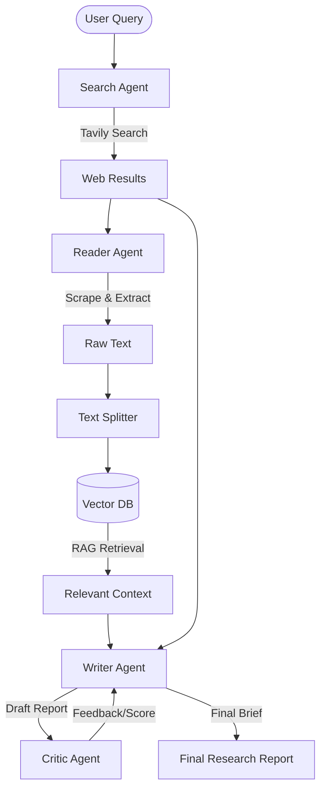

# 🚀 AI Research Assistant


An advanced **multi-agent AI system** that performs web search, extracts content, and generates structured research reports with automated critique using LLMs and Retrieval-Augmented Generation (RAG).

---

## 🧠 Overview

This project simulates a real-world **AI research workflow** by orchestrating multiple intelligent agents:

1. 🔍 **Search Agent** – Finds relevant sources from the web
2. 📖 **Reader Agent** – Scrapes and extracts useful content
3. 🧩 **RAG Pipeline** – Stores and retrieves semantic context
4. ✍️ **Writer Agent** – Generates structured research reports
5. 🧪 **Critic Agent** – Evaluates and improves output quality

---

## ✨ Features

* 🔄 Multi-agent architecture using the modern LangChain `create_agent` API and LangGraph
* 🌐 Web search + content scraping (Tavily + BeautifulSoup)
* 🧠 RAG pipeline using Chroma + HuggingFace embeddings
* 📊 Structured research reports (Executive Summary, Findings, Risks, etc.)
* 🧪 Automated LLM-based critique system
* ⚡ FastAPI backend with interactive frontend
* 🎨 Clean UI with real-time pipeline visualization

---

## 🏗️ Tech Stack

### Backend

* FastAPI
* LangChain + LangGraph
* Mistral AI (LLM)

### RAG & Data

* Chroma (Vector Database)
* HuggingFace Embeddings
* Recursive Text Splitting

### Tools

* Tavily Search API
* BeautifulSoup (Web Scraping)

### Frontend

* HTML, CSS, JavaScript

---

## ⚙️ How It Works



---

## 🚀 Run Locally

### 1. Clone the repository

```bash
git clone https://github.com/ranveer101/AI_RESEARCH_AGENT.git
cd AI_RESEARCH_AGENT
```

### 2. Create virtual environment

```bash
python -m venv .venv
.\.venv\Scripts\activate   # Windows
```

### 3. Install dependencies

```bash
pip install -r requirements.txt
```

### 4. Setup environment variables

Create `.env` file:

```env
MISTRAL_API_KEY=your_key_here
TAVILY_API_KEY=your_key_here
```

### 5. Run the app

```bash
uvicorn api:app --host 127.0.0.1 --port 8000
```

### 6. Open in browser

```
http://127.0.0.1:8000/
```

---

## 🌐 Deployment (Render)

### Build Command

```bash
pip install -r requirements.txt
```

### Start Command

```bash
uvicorn api:app --host 0.0.0.0 --port $PORT
```

### Environment Variables

* MISTRAL_API_KEY
* TAVILY_API_KEY

---

## 📌 Example Use Case

**Input:**

```
Impact of AI on Indian economy
```

**Output:**

* Executive Summary
* Key Findings
* India-Specific Insights
* Risks & Uncertainties
* Conclusion
* Sources

---

## 🔐 Security Note

* Do NOT commit your `.env` file
* Always use environment variables for API keys

---

## 🎯 Future Improvements

* 🔄 Streaming responses
* 📊 Better ranking & reranking
* 🧠 Memory-based context retention
* 📦 Docker support
* 🌍 Multi-language support

---

## 👨‍💻 Author

**Ranveer Singh**

* GitHub: https://github.com/ranveer101

---


